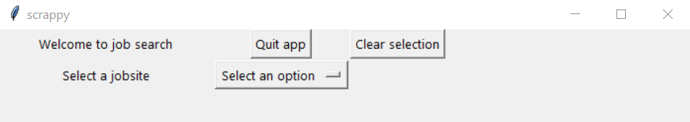

# Scrappy: automating job search

A little backstory about how this project came to be. I was looking for a job in Belgium (Flemish area in particular) between May and June 2025. My main issue is that my Dutch language skills are pretty weak which means that I had to look for the few English job descriptions on [LinkedIn](https://www.linkedin.com/jobs/) and [VDAB](https://www.vdab.be/vindeenjob/vacatures?sort=standaard) (the Flemish Employment Service). Manually opening and reading one job ad after another was tedious. Automating this process should save time. Hence I made this app, scrappy, that collects all available job positions on these two jobsites and identifies the academic, technical and language criteria. It save this infomation for each job in an excel sheet along with information about the employer, location and the date posted. I also integrated the ChatGPT API to look for the criteria in the job descriptions, so to use this you need your own [API key](https://platform.openai.com/api-keys) from ChatGPT. Making the app was a personal project to learn webscrapping and how to build a GUI. 

## Usage (app)



## Usage (python)
```python
from scrap_vdab import vdab

url = 'https://www.vdab.be/vindeenjob/vacatures?trefwoord=biologie&locatie=Brussel%20(Regio)&locatieCode=BE1&sort=standaard' # example
apikey = '..' # add your own from here https://platform.openai.com/api-keys

# initialize search
search = vdab(url, apikey, path= 'jobs')

# collect the links of all jobs that match your job criteria
alljobs = search.get_jobs_vdab()
alljobs_list = search.unlist_get_href(alljobs)

# load job descriptions and use chatgpt to find the language, academic and technical requirements and save these in an excel sheet 
search.get_job_description(alljobs_list)
```
See the `scrapping.ipynb` jupyter notebook for a more detailed usage example

## Licence

[MIT](https://choosealicense.com/licenses/mit/)
